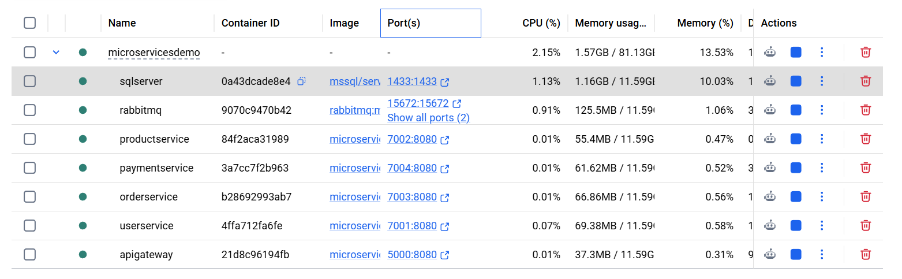

# Microservices Order Management Platform

A scalable **microservices-based backend system** designed to demonstrate modern distributed architecture using **ASP.NET Core, Docker, and RabbitMQ**.

The platform enables independent services to communicate asynchronously through messaging while being exposed through a centralized **API Gateway**.

The system follows **Clean Architecture principles** and a **service-oriented architecture**, enabling scalability, maintainability, and production-ready deployment.

---

# Overview

The platform consists of the following core services:

## 1. Product Service

Responsible for managing product data and catalog operations.

Key responsibilities:

* Product creation and retrieval
* Inventory management
* REST API exposure

---

## 2. User Service

Handles user-related operations and data.

Key responsibilities:

* User creation and retrieval
* Basic user management
* Service communication

---

## 3. Order Service

Manages order lifecycle and business logic.

Key responsibilities:

* Order creation
* Publishing events to RabbitMQ
* Order processing workflows

---

## 4. Payment Service

Processes payments asynchronously based on events.

Key responsibilities:

* Consuming order events from RabbitMQ
* Payment processing
* Payment status handling

---

## 5. API Gateway (YARP)

Acts as the single entry point for all services.

Key responsibilities:

* Routing incoming requests
* Abstracting internal services
* Centralized API access

---

# Key Features

## Microservices Architecture

* Independent deployable services
* Loose coupling between components
* Service scalability and isolation

---

## Event-Driven Communication

* RabbitMQ-based messaging
* Asynchronous service interaction
* Reliable message delivery

---

## Containerized Deployment

* Docker-based service deployment
* Docker Compose orchestration
* Environment consistency

---

## API Gateway

* Centralized routing using YARP
* Simplified client interaction
* Hidden internal service structure

---

# Architecture

The system follows a **microservices architecture** with event-driven communication:

```
Client Request
     │
     ▼
API Gateway (YARP)
     │
 ┌───┼───────────────┐
 │   │               │
 ▼   ▼               ▼
User Product       Order Service
Service Service         │
                       ▼
                  RabbitMQ Queue
                       │
                       ▼
                 Payment Service
```

This architecture enables:

* Scalable service deployment
* Decoupled service communication
* Fault isolation between services
* Asynchronous processing

---

# Technology Stack

## Backend

* ASP.NET Core Web API
* YARP (API Gateway)
* Entity Framework Core

## Messaging

* RabbitMQ

## Infrastructure

* Docker
* Docker Compose

## Database

* SQL Server

---

# 🐳 Running Containers

The following screenshot shows all microservices running inside Docker:



---

# System Workflow

1. Client sends request through API Gateway.
2. Request is routed to the appropriate microservice.
3. Order Service publishes an event to RabbitMQ.
4. Payment Service consumes the event asynchronously.
5. Payment result is processed and stored.

---

# What This Project Demonstrates

* Microservices architecture design
* Docker containerization
* Event-driven systems using RabbitMQ
* API Gateway implementation using YARP
* Scalable backend system design
